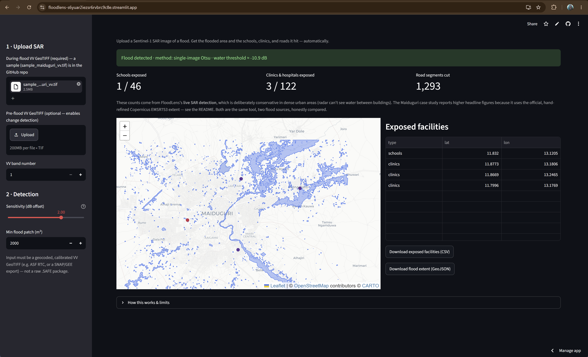

# FloodLens — flood exposure mapping with OpenStreetMap

### *"Flooded, and the Shelter Too"*

A tool to map flood exposure from Sentinel-1 SAR imagery, and identify which schools,
clinics, and roads a flood hit — demonstrated on the **September 2024 Maiduguri flood**
and **validated against the official Copernicus EMS product (EMSR753)**.

Built for **MapKaton 2026**.



---

## Two things in this project

**1. FloodLens — the tool (`sar_flood_app.py`).** A no-code Streamlit app. Upload an
analysis-ready Sentinel-1 VV backscatter GeoTIFF of a flood; it automatically detects the
flooded area (Otsu thresholding, plus change detection when a pre-flood image is supplied),
pulls OpenStreetMap schools/clinics/roads over the scene, and reports exposure with a map
and a downloadable list. Designed for remote-sensing users and responders who need a fast
first-look after *any* flood, anywhere.

**2. The Maiduguri case study (`maiduguri_flood_exposure.py` + `streamlit_dashboard.py`).**
The worked, validated example that proves the method: an independent Sentinel-1 flood extent
overlaid on OSM, with exposure computed against the authoritative EMSR753 delineation and a
dashboard to explore it.

## Data sources

| Layer | Source | Access |
| --- | --- | --- |
| Flood extent (authoritative) | Copernicus EMS **EMSR753** observed-event delineation | Copernicus EMS portal / HDX |
| Flood extent (independent) | **Sentinel-1** SAR, VV, IW mode | Google Earth Engine / ASF |
| Infrastructure | **OpenStreetMap** (schools, clinics, roads, buildings) | Overpass API (live) |
| Permanent-water / terrain masks | JRC Global Surface Water, HydroSHEDS | Google Earth Engine |

## Repository contents

- `sar_flood_app.py` — **FloodLens**, the no-code upload tool.
- `maiduguri_flood_exposure.py` — the Maiduguri analysis pipeline (SAR extent, OSM pull,
  exposure vs EMSR753, SAR-vs-official validation). `--export-vv` dumps test GeoTIFFs.
- `streamlit_dashboard.py` — dashboard for the Maiduguri case study.
- `DATA_STORY.md` — the one-page narrative.
- Outputs (generated): `flood_mask.tif`, `flood_extent.geojson`, `exposure_summary.csv`,
  `exposed_facilities.geojson`, `during_vv.tif`, `pre_vv.tif`.

---

## Setup

```bash
python -m venv .venv
source .venv/bin/activate            # Windows: .venv\Scripts\Activate.ps1
pip install earthengine-api geemap osmnx geopandas folium shapely mapclassify rasterio \
            scikit-image streamlit streamlit-folium
```

For the Maiduguri pipeline you also need a Google Earth Engine account: register a Cloud
project for Earth Engine, run `earthengine authenticate`, and set `GCP_PROJECT` at the top
of `maiduguri_flood_exposure.py`. Download the **EMSR753** vector package (Copernicus EMS
portal or HDX) and point `OFFICIAL_FLOOD` at its `observedEventA` shapefile.

## Run

```bash
# FloodLens (the tool) — upload a VV GeoTIFF, no GEE needed
streamlit run sar_flood_app.py

# Maiduguri case study
python maiduguri_flood_exposure.py            # exposure vs EMSR753 + validation
streamlit run streamlit_dashboard.py          # explore the result

# Generate test GeoTIFFs for FloodLens from the Maiduguri data
python maiduguri_flood_exposure.py --export-vv
```

## Method (summary)

**SAR flood detection.** `COPERNICUS/S1_GRD` backscatter is in decibels, so change is a
*subtraction*, not a ratio. A pixel is flagged as flood where the during image is both
darker than before (backscatter dropped) *and* dark in absolute terms — open water is
specular and returns little to the sensor. FloodLens finds the water/land split
automatically with **Otsu thresholding**; supplying a pre-flood image adds a change gate
that removes permanent rivers and lakes. Permanent water (JRC) and steep terrain
(HydroSHEDS) are masked; small patches are dropped. Vectorization is done locally.

**Exposure.** Each OSM facility is tested for containment within the flood polygon.

**Validation.** The independent SAR extent is compared to EMSR753 inside the mapped AOI.
*Containment* (fraction of SAR inside the official extent) is the fair headline; IoU is
lower only because the official layer also includes hand-mapped urban inundation.

## Results (Maiduguri)

These headline figures are computed against the **official Copernicus EMSR753 flood extent**
(the authoritative, hand-refined polygon):

- Schools exposed: **7 / 41 mapped** · Clinics & hospitals: **16 / 78 mapped**
- Buildings in flood zone: **~30,300 (~19%)** · Road segments cut: **~2,545**
- **Independent SAR vs official containment: 97.6%** (IoU 12.9% within the mapped AOI)

**Two flood sources, one tool — read this to avoid confusion.** The interactive FloodLens app
(`sar_flood_app.py`) runs its *own* SAR flood detection live from an uploaded image, so its
on-screen counts are **lower** (e.g. ~3 schools / ~4 clinics) than the figures above. That is
expected: live SAR detection is deliberately conservative in dense urban cores (radar can't
see water between buildings), whereas the headline numbers use the official Copernicus extent,
which includes hand-mapped urban inundation. Same method, two flood sources — the difference
between them is itself the honest story of where SAR needs help.

---

## Limitations & future work

FloodLens is deliberately honest about what SAR thresholding can and cannot do.

**Urban under-detection (double-bounce).** In dense city cores, flooding often makes
backscatter go *up*, not down: the water surface and building walls form a corner reflector
that bounces the signal straight back, so flooded blocks can appear *bright*. A dark-water
detector cannot see these — which is why the independent SAR extent under-counts the urban
core (the reason the Maiduguri headline numbers use the official EMSR753 extent). This is a
known property of SAR, not a bug in the method.

**OSM completeness — and what the numbers mean.** This tool identifies **7 flooded
schools**: those both mapped in OpenStreetMap *and* inside the observed flood extent.
Humanitarian field reports (UN OCHA / UNICEF) later reported **~56 schools flooded** across
the city. Comparing flooded-with-flooded, the distance between 7 and ~56 is not a detection
failure — it measures two real data limitations:

- **Map coverage.** OpenStreetMap has only **41 schools mapped in total** across this area —
  fewer than the number reported flooded. The tool can only find flooded schools that are on
  the map; the rest are invisible because no one has mapped them yet.
- **Extent definition.** The satellite-observed flood polygon captures open standing water at
  the moment of imaging; field teams counted schools "flooded/affected" over time and across
  areas (shallow urban flooding, shelter damage) that a single water snapshot doesn't include.

That gap *is* the finding. A facility-level tool is only as complete as the map beneath it,
and here the open map holds fewer schools in total than one flood damaged. Quantifying that
gap shows the OSM community exactly where mapping is most needed, and tells responders not to
treat the map as complete. Strengthening OSM coverage directly improves the next response.

Note also that Copernicus EMS publishes the flood *extent*, not a list of named affected
facilities — identifying *which* schools and clinics were exposed is precisely what the
OpenStreetMap overlay contributes.

**Where this goes next:**

- **Optical fusion.** Optical sensors (Sentinel-2, NDWI) see urban water that radar misses,
  because they detect water by reflectance rather than roughness — but clouds and daylight
  limit availability exactly when floods peak. SAR gives the all-weather instant first look;
  optical fills in detail once skies clear. A future NDWI mode would let FloodLens fuse both.
- **Learned flood segmentation.** Deep-learning models trained on labelled SAR floods
  recover inundation a threshold never will, because they learn what flooding *looks like*.
  Recent work points the way: Doan & Le-Thi (2025) use a Siamese Swin-Transformer for
  bi-temporal SAR flood change detection (~95.7% F1), and Zhou et al. (2025) apply
  transformer segmentation to SAR flood recognition — both building on the **Sen1Floods11**
  labelled dataset. A pretrained Sen1Floods11 model is the natural next FloodLens mode.

## AI use disclosure

This project was built with substantial help from an AI assistant (Anthropic's Claude),
used as a pair-programming and writing partner: to design the analysis approach, write and
debug the Python pipeline and Streamlit apps, and draft this documentation. All outputs were
reviewed and validated by the author — flood extents were checked visually in QGIS and
cross-validated against the official Copernicus EMS EMSR753 product (97.6% containment), and
the tool's limitations (SAR under-detection in dense urban cores; OpenStreetMap completeness
gaps) are documented openly above. No AI-generated data was uploaded to OpenStreetMap.

---

*Credits: OpenStreetMap contributors (ODbL); Copernicus EMS (EMSR753); Copernicus
Sentinel-1 via Google Earth Engine / ASF. Built for MapKaton 2026.*
